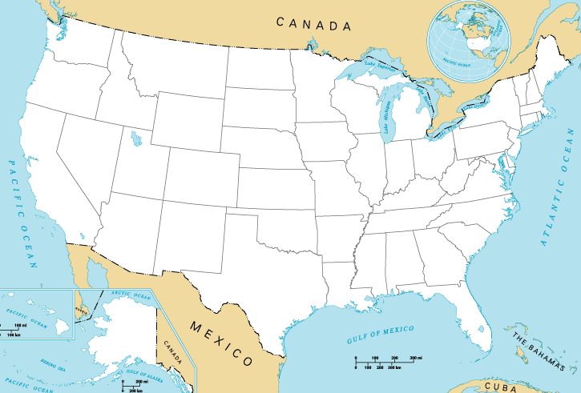

# 🗺️ U.S. States Guessing Game

A fun and educational game to test your knowledge of the 50 U.S. states, built using **Python**, **Turtle**, and **Pandas**. The game presents a blank U.S. map, and your job is to guess all the state names!



---

## 🎮 How to Play

- A blank map of the U.S. is displayed.
- You are prompted to enter the name of a U.S. state.
- If correct:
  - The state name is displayed on the map at the correct location.
- If you type **`Exit`**, the game ends and shows you the list of **states you missed**.
- Goal: Name all **50** states correctly!

---

## 🧠 Features

- 🧩 Interactive guessing game using `turtle.textinput()`
- ✅ Correct guesses are shown on the map
- ❌ Missed states are saved and printed at the end
- 📍 Uses `50_states.csv` to get coordinates and state names

---

## 📦 Requirements

- Python 3.x
- pandas
- turtle
- Files required in the same directory:
  - `50_states.csv` – CSV file with columns: `state`, `x`, `y`
  - `blank_states_img.gif` – Image of the U.S. map (used as Turtle shape)

---

## 🚀 How to Run

1. Clone or download this repository.

2. Make sure the following files are in the same folder:
   - `us_states_game.py` (or whatever your filename is)
   - `blank_states_img.gif`
   - `50_states.csv`

3. Install pandas (if not already installed):
   ```bash
   pip install pandas
